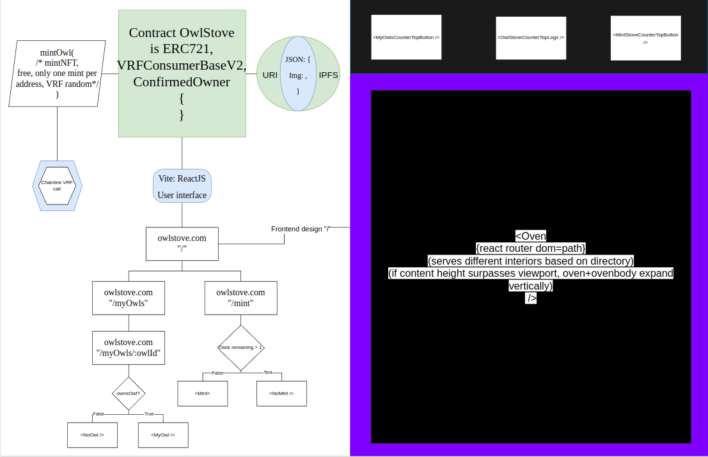

# OwlStove

🦉🦉🦉

 <b> What's going on in the OwlStove? </b> 

OwlStove the epitome of elite, presenting a collection of 33 NFTs that are straight-up fresh. We push the boundaries of digital art, blending cutting-edge aBFT consensus with a bold and daring aesthetic. If you're wondering what the Owls are doing in the stove, get stuck in. These pieces embody the new era of swag, inspiring a zeitgeist of self-expression in the digital world. 

🦉🦉🦉

 Check out OwlStove in production ➡️ <a href="#">OwlStove.com</a> 

🦉🦉🦉

# The technical implementation

Below is an image of the blockend + frontend schematic of the dapp, to have a more granular view of each element please refer to the "Blockend" and "Frontend" folders respectively:

